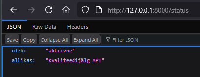
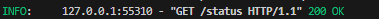
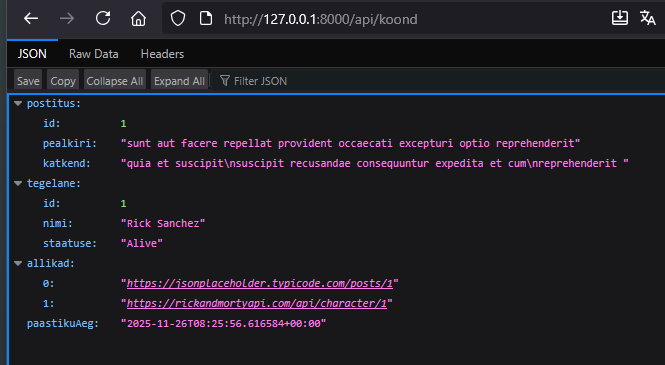
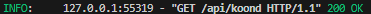
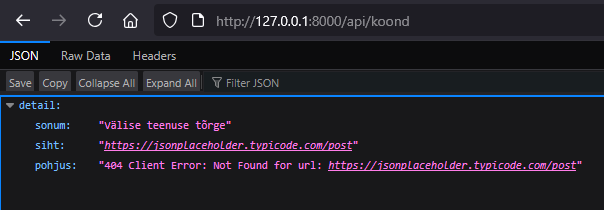

# Task 2 testi tulemused

## Endpointide kontrollimine

- `GET /status` – serveri seisundi kontrollimine.

- `GET /api/koond` – ühendatud vastus JSONPlaceholder + Rick & Morty.

- Välise API vea korral tagastatakse HTTP 502 koos üksikasjaliku kirjeldusega.

